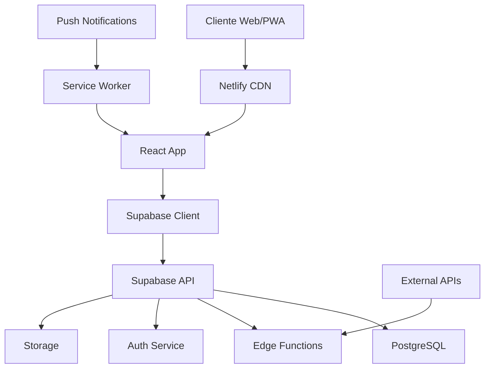

# 🛠️ Guia do Desenvolvedor - Family Flow Finance

## 📋 Índice
- [Visão Geral](#visão-geral)
- [Arquitetura](#arquitetura)
- [Configuração do Ambiente](#configuração-do-ambiente)
- [Estrutura do Projeto](#estrutura-do-projeto)
- [APIs e Integrações](#apis-e-integrações)
- [Base de Dados](#base-de-dados)
- [Autenticação e Autorização](#autenticação-e-autorização)
- [Testes](#testes)
- [Deploy](#deploy)
- [Contribuição](#contribuição)

---

## 🎯 Visão Geral

O **Family Flow Finance** é uma aplicação web moderna de gestão financeira familiar construída com:

- **Frontend**: React 18 + TypeScript + Vite
- **Backend**: Supabase (PostgreSQL + Edge Functions)
- **UI**: Tailwind CSS + Shadcn/ui
- **Autenticação**: Supabase Auth (OAuth + Email)
- **Deploy**: Netlify (Frontend) + Supabase (Backend)

### Características Técnicas
- ✅ **PWA** - Progressive Web App
- ✅ **Offline-first** - Funcionalidade offline
- ✅ **Real-time** - Atualizações em tempo real
- ✅ **Multi-tenant** - Sistema de famílias
- ✅ **RLS** - Row Level Security
- ✅ **TypeScript** - Type safety completo

---

## 🏗️ Arquitetura

### Visão Geral da Arquitetura



### Camadas da Aplicação

#### 1. **Presentation Layer** (React)
- Componentes UI reutilizáveis
- Gestão de estado com Context API
- Routing com React Router
- Forms com React Hook Form + Zod

#### 2. **Business Logic Layer**
- Custom hooks para lógica de negócio
- Validação de dados com Zod schemas
- Transformação de dados
- Cache management

#### 3. **Data Access Layer**
- Supabase client configuration
- Real-time subscriptions
- Optimistic updates
- Error handling

#### 4. **Backend Services** (Supabase)
- PostgreSQL com RLS
- Edge Functions (Deno)
- Authentication & Authorization
- File Storage

---

## ⚙️ Configuração do Ambiente

### Pré-requisitos
- **Node.js** >= 18.0.0
- **npm** >= 9.0.0
- **Git**
- **Supabase CLI** (opcional)

### Instalação Local

```bash
# 1. Clone o repositório
git clone https://github.com/your-org/family-flow-finance.git
cd family-flow-finance

# 2. Instale dependências
npm install

# 3. Configure variáveis de ambiente
cp .env.example .env.local
# Edite .env.local com suas configurações

# 4. Execute em modo desenvolvimento
npm run dev

# 5. Execute testes
npm test

# 6. Build para produção
npm run build
```

### Variáveis de Ambiente

```env
# Supabase
VITE_SUPABASE_URL=your_supabase_url
VITE_SUPABASE_ANON_KEY=your_anon_key
SUPABASE_SERVICE_ROLE_KEY=your_service_role_key

# App Configuration
VITE_BASE_PATH=/
VITE_APP_ENV=development

# Push Notifications
VITE_VAPID_PUBLIC_KEY=your_vapid_public_key
VITE_VAPID_PRIVATE_KEY=your_vapid_private_key

# Features Flags
VITE_PAYROLL_AUTO_DEDUCTIONS=true
```

---

## 📁 Estrutura do Projeto

```
src/
├── components/          # Componentes reutilizáveis
│   ├── ui/             # Componentes base (shadcn/ui)
│   ├── forms/          # Componentes de formulários
│   ├── charts/         # Componentes de gráficos
│   └── layout/         # Componentes de layout
├── pages/              # Páginas da aplicação
├── hooks/              # Custom hooks
├── lib/                # Utilitários e configurações
│   ├── supabase.ts     # Cliente Supabase
│   ├── utils.ts        # Funções utilitárias
│   └── constants.ts    # Constantes
├── types/              # Definições TypeScript
├── validation/         # Schemas Zod
├── contexts/           # React Contexts
├── services/           # Serviços de API
└── assets/             # Assets estáticos

supabase/
├── functions/          # Edge Functions
├── migrations/         # Migrações SQL
└── seed.sql           # Dados iniciais

docs/                   # Documentação
tests/                  # Testes
public/                 # Assets públicos
```

### Convenções de Nomenclatura

- **Componentes**: PascalCase (`TransactionForm.tsx`)
- **Hooks**: camelCase com prefixo `use` (`useTransactions.ts`)
- **Utilitários**: camelCase (`formatCurrency.ts`)
- **Constantes**: UPPER_SNAKE_CASE (`API_ENDPOINTS`)
- **Tipos**: PascalCase (`Transaction`, `User`)

---

## 🔌 APIs e Integrações

### Supabase Client

```typescript
// lib/supabase.ts
import { createClient } from '@supabase/supabase-js'
import type { Database } from '@/types/database'

const supabaseUrl = import.meta.env.VITE_SUPABASE_URL
const supabaseAnonKey = import.meta.env.VITE_SUPABASE_ANON_KEY

export const supabase = createClient<Database>(
  supabaseUrl,
  supabaseAnonKey,
  {
    auth: {
      autoRefreshToken: true,
      persistSession: true,
      detectSessionInUrl: true
    }
  }
)
```

### Custom Hooks Pattern

```typescript
// hooks/useTransactions.ts
export function useTransactions(accountId?: string) {
  const [transactions, setTransactions] = useState<Transaction[]>([])
  const [loading, setLoading] = useState(true)
  const [error, setError] = useState<string | null>(null)

  const fetchTransactions = useCallback(async () => {
    try {
      setLoading(true)
      const { data, error } = await supabase
        .from('transactions')
        .select('*')
        .eq(accountId ? 'account_id' : '', accountId || '')
        .order('date', { ascending: false })

      if (error) throw error
      setTransactions(data || [])
    } catch (err) {
      setError(err.message)
    } finally {
      setLoading(false)
    }
  }, [accountId])

  useEffect(() => {
    fetchTransactions()
  }, [fetchTransactions])

  return { transactions, loading, error, refetch: fetchTransactions }
}
```

### Edge Functions

```typescript
// supabase/functions/goal-funding-cron/index.ts
import { serve } from 'https://deno.land/std@0.168.0/http/server.ts'
import { createClient } from 'https://esm.sh/@supabase/supabase-js@2'

serve(async (req) => {
  try {
    const supabase = createClient(
      Deno.env.get('SUPABASE_URL') ?? '',
      Deno.env.get('SUPABASE_SERVICE_ROLE_KEY') ?? ''
    )

    // Lógica de financiamento automático de objetivos
    const { data: goals } = await supabase
      .from('goals')
      .select('*')
      .eq('auto_funding_enabled', true)

    // Processar cada objetivo...

    return new Response(
      JSON.stringify({ success: true, processed: goals?.length || 0 }),
      { headers: { 'Content-Type': 'application/json' } }
    )
  } catch (error) {
    return new Response(
      JSON.stringify({ error: error.message }),
      { status: 500, headers: { 'Content-Type': 'application/json' } }
    )
  }
})
```

---

## 🗄️ Base de Dados

### Esquema Principal

```sql
-- Famílias
CREATE TABLE families (
  id UUID PRIMARY KEY DEFAULT gen_random_uuid(),
  name TEXT NOT NULL,
  created_at TIMESTAMPTZ DEFAULT NOW(),
  updated_at TIMESTAMPTZ DEFAULT NOW()
);

-- Membros da família
CREATE TABLE family_members (
  id UUID PRIMARY KEY DEFAULT gen_random_uuid(),
  family_id UUID REFERENCES families(id) ON DELETE CASCADE,
  user_id UUID REFERENCES auth.users(id) ON DELETE CASCADE,
  role family_role NOT NULL DEFAULT 'member',
  joined_at TIMESTAMPTZ DEFAULT NOW(),
  UNIQUE(family_id, user_id)
);

-- Contas
CREATE TABLE accounts (
  id UUID PRIMARY KEY DEFAULT gen_random_uuid(),
  family_id UUID REFERENCES families(id) ON DELETE CASCADE,
  name TEXT NOT NULL,
  type account_type NOT NULL,
  balance DECIMAL(15,2) DEFAULT 0,
  is_active BOOLEAN DEFAULT true,
  created_at TIMESTAMPTZ DEFAULT NOW()
);

-- Transações
CREATE TABLE transactions (
  id UUID PRIMARY KEY DEFAULT gen_random_uuid(),
  account_id UUID REFERENCES accounts(id) ON DELETE CASCADE,
  amount DECIMAL(15,2) NOT NULL,
  type transaction_type NOT NULL,
  category_id UUID REFERENCES categories(id),
  description TEXT,
  date DATE NOT NULL,
  created_at TIMESTAMPTZ DEFAULT NOW()
);
```

### Row Level Security (RLS)

```sql
-- Política para famílias
CREATE POLICY "Users can only access their family data" ON families
  FOR ALL USING (
    id IN (
      SELECT family_id FROM family_members 
      WHERE user_id = auth.uid()
    )
  );

-- Política para transações
CREATE POLICY "Users can access family transactions" ON transactions
  FOR ALL USING (
    account_id IN (
      SELECT a.id FROM accounts a
      JOIN family_members fm ON a.family_id = fm.family_id
      WHERE fm.user_id = auth.uid()
    )
  );
```

### Migrações

```sql
-- 20240101000000_create_families.sql
CREATE TYPE family_role AS ENUM ('owner', 'admin', 'member', 'viewer');
CREATE TYPE account_type AS ENUM ('checking', 'savings', 'investment', 'credit_card', 'cash', 'other');
CREATE TYPE transaction_type AS ENUM ('income', 'expense', 'transfer');

-- Criar tabelas...
-- Criar políticas RLS...
-- Criar índices...
```

---

## 🔐 Autenticação e Autorização

### Fluxo de Autenticação

```typescript
// contexts/AuthContext.tsx
export function AuthProvider({ children }: { children: ReactNode }) {
  const [user, setUser] = useState<User | null>(null)
  const [loading, setLoading] = useState(true)

  useEffect(() => {
    // Verificar sessão existente
    supabase.auth.getSession().then(({ data: { session } }) => {
      setUser(session?.user ?? null)
      setLoading(false)
    })

    // Escutar mudanças de autenticação
    const { data: { subscription } } = supabase.auth.onAuthStateChange(
      async (event, session) => {
        setUser(session?.user ?? null)
        setLoading(false)
      }
    )

    return () => subscription.unsubscribe()
  }, [])

  return (
    <AuthContext.Provider value={{ user, loading }}>
      {children}
    </AuthContext.Provider>
  )
}
```

### Proteção de Rotas

```typescript
// components/RequireAuth.tsx
export function RequireAuth({ children }: { children: ReactNode }) {
  const { user, loading } = useAuth()
  const location = useLocation()

  if (loading) {
    return <LoadingSpinner />
  }

  if (!user) {
    return <Navigate to="/login" state={{ from: location }} replace />
  }

  return <>{children}</>
}
```

### Verificação de Permissões

```typescript
// hooks/usePermissions.ts
export function usePermissions() {
  const { user } = useAuth()
  const { familyMember } = useFamilyMember()

  const canManageMembers = useMemo(() => {
    return familyMember?.role === 'owner' || familyMember?.role === 'admin'
  }, [familyMember])

  const canDeleteFamily = useMemo(() => {
    return familyMember?.role === 'owner'
  }, [familyMember])

  return {
    canManageMembers,
    canDeleteFamily,
    canViewData: !!familyMember,
    canEditData: familyMember?.role !== 'viewer'
  }
}
```

---

## 🧪 Testes

### Configuração de Testes

```typescript
// vitest.config.ts
import { defineConfig } from 'vitest/config'
import react from '@vitejs/plugin-react'
import path from 'path'

export default defineConfig({
  plugins: [react()],
  test: {
    environment: 'jsdom',
    setupFiles: ['./src/test/setup.ts'],
    globals: true
  },
  resolve: {
    alias: {
      '@': path.resolve(__dirname, './src')
    }
  }
})
```

### Testes de Componentes

```typescript
// tests/components/TransactionForm.test.tsx
import { render, screen, fireEvent, waitFor } from '@testing-library/react'
import { TransactionForm } from '@/components/forms/TransactionForm'
import { TestWrapper } from '@/test/TestWrapper'

describe('TransactionForm', () => {
  it('should submit valid transaction', async () => {
    const onSubmit = vi.fn()
    
    render(
      <TestWrapper>
        <TransactionForm onSubmit={onSubmit} />
      </TestWrapper>
    )

    fireEvent.change(screen.getByLabelText(/valor/i), {
      target: { value: '100.50' }
    })
    
    fireEvent.click(screen.getByRole('button', { name: /guardar/i }))

    await waitFor(() => {
      expect(onSubmit).toHaveBeenCalledWith({
        amount: 100.50,
        type: 'expense',
        // ...
      })
    })
  })
})
```

### Testes de Integração

```typescript
// tests/integration/transactions.test.tsx
import { renderHook, waitFor } from '@testing-library/react'
import { useTransactions } from '@/hooks/useTransactions'
import { TestWrapper } from '@/test/TestWrapper'

describe('useTransactions Integration', () => {
  it('should fetch and display transactions', async () => {
    const { result } = renderHook(() => useTransactions(), {
      wrapper: TestWrapper
    })

    expect(result.current.loading).toBe(true)

    await waitFor(() => {
      expect(result.current.loading).toBe(false)
      expect(result.current.transactions).toHaveLength(3)
    })
  })
})
```

### Scripts de Teste

```json
{
  "scripts": {
    "test": "vitest",
    "test:ui": "vitest --ui",
    "test:coverage": "vitest --coverage",
    "test:e2e": "cypress run",
    "test:e2e:open": "cypress open"
  }
}
```

---

## 🚀 Deploy

### Frontend (Netlify)

```toml
# netlify.toml
[build]
  command = "npm run build"
  publish = "dist"

[build.environment]
  NODE_VERSION = "18"

[[redirects]]
  from = "/*"
  to = "/index.html"
  status = 200

[[headers]]
  for = "/*"
  [headers.values]
    X-Frame-Options = "DENY"
    X-Content-Type-Options = "nosniff"
    Referrer-Policy = "strict-origin-when-cross-origin"
```

### Backend (Supabase)

```bash
# Deploy migrações
supabase db push

# Deploy edge functions
supabase functions deploy goal-funding-cron
supabase functions deploy push-delivery
supabase functions deploy reminders-push-cron
```

### CI/CD Pipeline

```yaml
# .github/workflows/deploy.yml
name: Deploy

on:
  push:
    branches: [main]

jobs:
  test:
    runs-on: ubuntu-latest
    steps:
      - uses: actions/checkout@v3
      - uses: actions/setup-node@v3
        with:
          node-version: 18
      - run: npm ci
      - run: npm run test
      - run: npm run build

  deploy:
    needs: test
    runs-on: ubuntu-latest
    steps:
      - uses: actions/checkout@v3
      - name: Deploy to Netlify
        uses: netlify/actions/cli@master
        with:
          args: deploy --prod --dir=dist
        env:
          NETLIFY_AUTH_TOKEN: ${{ secrets.NETLIFY_AUTH_TOKEN }}
          NETLIFY_SITE_ID: ${{ secrets.NETLIFY_SITE_ID }}
```

---

## 🤝 Contribuição

### Fluxo de Desenvolvimento

1. **Fork** o repositório
2. **Clone** o seu fork
3. **Crie** uma branch para a feature: `git checkout -b feature/nova-funcionalidade`
4. **Desenvolva** seguindo as convenções
5. **Teste** as alterações
6. **Commit** com mensagens descritivas
7. **Push** para o seu fork
8. **Abra** um Pull Request

### Convenções de Commit

```
feat: adiciona nova funcionalidade de orçamentos
fix: corrige cálculo de saldo em transferências
docs: atualiza documentação da API
style: formata código com prettier
refactor: reorganiza estrutura de componentes
test: adiciona testes para TransactionForm
chore: atualiza dependências
```

### Code Review Checklist

- [ ] **Funcionalidade**: Código funciona conforme esperado
- [ ] **Testes**: Cobertura adequada de testes
- [ ] **Performance**: Sem impactos negativos
- [ ] **Segurança**: Validações e autorizações corretas
- [ ] **Acessibilidade**: Componentes acessíveis
- [ ] **Documentação**: Código bem documentado
- [ ] **TypeScript**: Types corretos e completos

### Estrutura de PR

```markdown
## Descrição
Breve descrição das alterações realizadas.

## Tipo de Mudança
- [ ] Bug fix
- [ ] Nova funcionalidade
- [ ] Breaking change
- [ ] Documentação

## Como Testar
1. Passos para reproduzir/testar
2. Dados de teste necessários
3. Comportamento esperado

## Screenshots
(Se aplicável)

## Checklist
- [ ] Testes passam
- [ ] Código segue convenções
- [ ] Documentação atualizada
- [ ] Self-review realizado
```

---

## 📚 Recursos Adicionais

### Documentação Técnica
- [Supabase Docs](https://supabase.com/docs)
- [React Docs](https://react.dev)
- [TypeScript Handbook](https://www.typescriptlang.org/docs/)
- [Tailwind CSS](https://tailwindcss.com/docs)

### Ferramentas de Desenvolvimento
- **VS Code Extensions**:
  - ES7+ React/Redux/React-Native snippets
  - Tailwind CSS IntelliSense
  - TypeScript Importer
  - Prettier - Code formatter
  - ESLint

### Performance e Monitorização
- **Lighthouse**: Auditoria de performance
- **Sentry**: Error tracking
- **Supabase Dashboard**: Monitorização de backend
- **Netlify Analytics**: Métricas de frontend

---

*Última atualização: Janeiro 2025*
*Versão do Guia: 1.0*